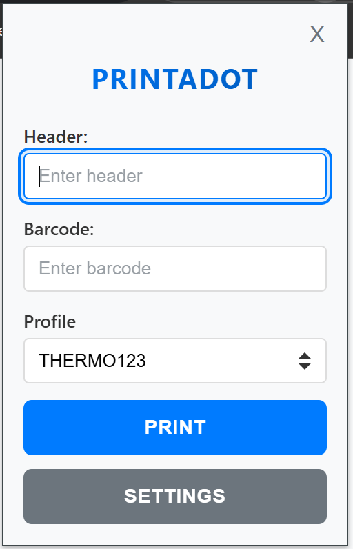
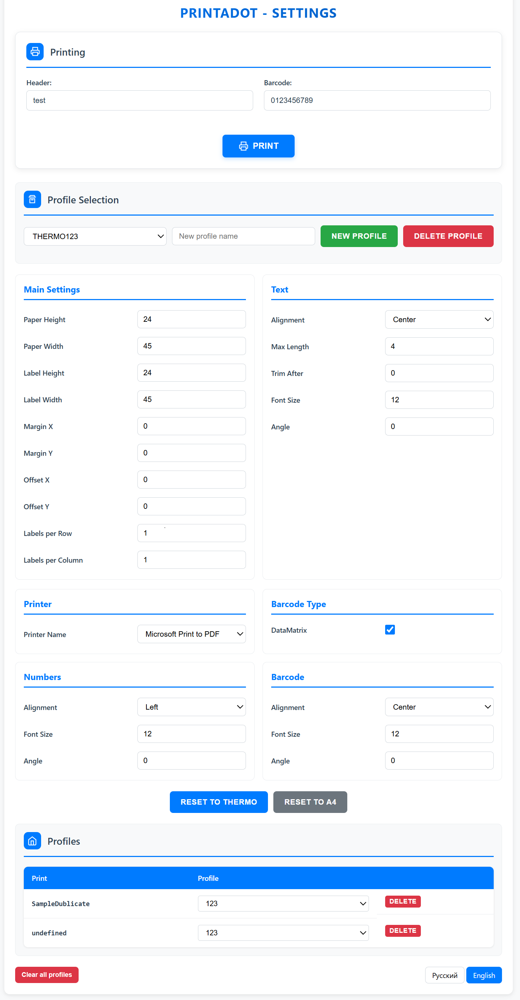

# PrintaDot

A Chrome extension for printing barcodes with customizable printing profiles and settings.

⚠️ WARNING - Native application required for correct work of extension. Latest version of exe you can find [here.](https://github.com/yourusername/barcode-printer-extension/releases/latest)

## Features

- **Popup Interface**: Quick access to barcode printing with header, barcode input, and profile selection
- **Customizable Printing Profiles**: Configure paper size, label dimensions, margins, text formatting, and more
- **Native Application Integration**: Requires companion desktop application for printing functionality
- **Developer API**: Programmatic printing from any website

## Usage

### Basic Printing

1. Click on the pinned extension icon in the browser toolbar
2. Enter the required data in the pop-up window:
   - Header text (optional)
   - Barcode content
   - Select printing profile
3. Press the **"Print"** button
4. Use the **"Settings"** button to configure printing profiles



### Printing Settings

The extension provides comprehensive printing configuration:

- **Paper Settings**: Paper height, width, margins, offsets
- **Label Layout**: Label dimensions, labels per row/column
- **Text Formatting**: Font size, alignment, maximum length, rotation
- **Barcode Options**: DataMatrix support, barcode alignment and rotation
- **Number Settings**: Font size, alignment, and rotation for figures
- **Printer Selection**: Choose specific printer



## Installation for developers

1. Open Chrome browser and navigate to: **Extensions** → **Enable Developer Mode**
2. Click **"Load unpacked extension"**, select the extension folder from the project, and click **"OK"**
3. Copy the extension identifier
4. Open `PrintLink.sln` file in Visual Studio
5. Go to `Manifest.cs` file and paste your extension identifier into `AllowedOrigins` in the format: `chrome-extension://Your_Identifier/`
6. Build the solution and run `PrintaDot.Windows` project
7. Once the manifest is generated and you see "application ready to work" in console, you can close it
8. Enable the extension and pin it to the browser toolbar

## Developer API

Integrate barcode printing directly into your web applications using the provided API.

### JavaScript Integration

```javascript
function sendPrintRequest(jsonData) {
    var printData = JSON.parse(jsonData);
    window.postMessage(printData, '*');
}
```

### Print Request Json Format

Print type field by default will map with A4 printing profile but you can change it in extension options. All json fields are required exept item figures. If you send empty or null items list to extensions it will print nothing.

```json
{
  "version": 1,
  "type": "PrintRequest",
  "printType": "*your print type*",
  "items": [
    {
      "header": "item header",
      "barcode": "123456789012",
      "figures": "text below barcode" //nullable
    }
  ] // nullable
}
```

⚠️ Note: The version and type fields are required for the extension to identify the message format. Currently, only "PrintRequest" with version: 1 is supported.
